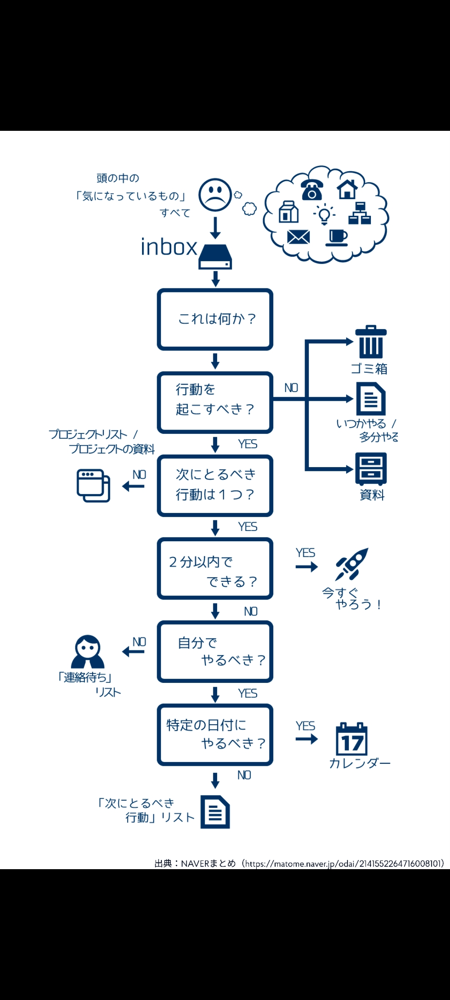
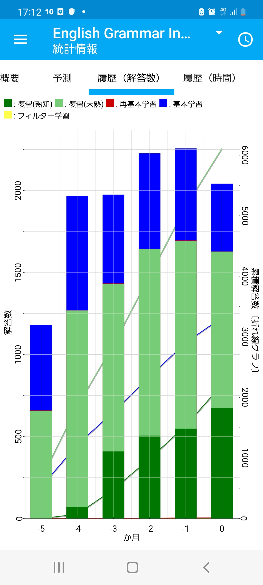

# 学習ノート2023

このリポジトリは個人の生涯学習ノートの代わりです。
ゆっくりしていってね。

- [ダーマ神殿 5年後のソフトウェア開発における役割「テクノロジーインテグレータ」 専門家AI](https://note.com/efujikawa/n/ndbae4ebb9d9a)

- [エンジニア目標はこちら](https://github.com/Eigo-Mt-Fuji/portfolio-2021/blob/main/docs/README-%E5%80%8B%E4%BA%BA%E5%AD%A6%E7%BF%92-20211215.md#1219-%E6%8B%A1%E5%BC%B5%E7%8F%BE%E5%AE%9Far%E3%81%AEsdk%E3%82%92%E8%AA%BF%E6%9F%BB%E3%81%99%E3%82%8B-web-ar-%E7%B7%A8)

- [お仕事の進捗はこちら](https://github.com/Eigo-Mt-Fuji/efg-confidential/blob/main/%E4%BA%8B%E6%A5%AD%E9%80%B2%E6%8D%97.md)

- [2022年はこちら](https://github.com/Eigo-Mt-Fuji/portfolio-2022)

## タスク処理

## エンジニアリングの術式

- 呪術廻戦の術式とかけてエンジニアリングと解く
  - 基本 方向性検知・課題特定 情報収集・アイデアの濃縮 情報整理・作業分解・設計 コーディング・ドキュメンテーション 
    - 生得術式 無下限呪術
      - 自身の周囲に無限を呼び出す
  - 強化する 組み合わせてみんなが喜ぶ複雑なものを作る 品質確保・再現性確保
    - 術式順転 蒼
      - 無限の術式を強化して生み出した負のエネルギーで攻撃する
  - 反転する 誰でも作れる/使えるように簡単化する 
    - 術式反転 赫
      - 反転術式によって生み出した正のエネルギー
  - 組み合わせる タイミングの最適化  作業分解・プロセスの省略 作らなくても目的を果たす
    - 虚式 茈
      - 蒼 と 赫を組み合わせる
  - 相手に作用する 可視化 共通認識化 レビュー指摘
    - 領域展開 無量空処( 術式の最終段階 )
      - 自分の心の中にある生得領域を現実に作り出す
        - 術者のステータスが向上し攻撃が必中になる
      - 「無限の知覚」を相手に強いる
        - 身動きを封じる

## コードレビューの極意・時間的制約

- 良いものを作るための環境は熟してきている。レビューは必ずしも人がやる役割ととらえない人が増えていくはず。
  - 参考1: https://zenn.dev/minedia/articles/7928ef7545b393
    - もう初回コードレビューはAIに任せる時代になった - CodeRabbit
- クライアントワーク（他人の夢を実現するエンジニアリング）の一環でのコードレビューで人の役割をどこに見出すかは、今後の動向を要観察
  - 成果を出すまでのプロセスに時間的制約があること、精度の期待値を常に忘れてはならない。（多分しばらくはAIで完全に置き換えることはできない）
    - ただ、AIで代替え可能ならスッと諦める。

- コードレビュー指摘に対する捉え方、その状況における判断基準が社会的適性を備えていることを大切にする必要がある。エンジニア文化の観察、社会動向の観察

- あと、つまんなくなったら終わり。モチベーションの目線でも忘れない

- ↓とりあえずGithub actionにAIを交えた、独自のレビュープロセスを地道に試していこう
  - https://github.com/Eigo-Mt-Fuji/catchup-nextjs-13-14/pull/22

## テスト・デシジョンテーブル

- 一番負荷の高い組合せテスト
- 限界値・境界値チェック
- 必須のデータは省略できないこと、任意のデータは省略できること
- 分岐網羅テスト(C0)
- デシジョンテーブルに基づくNGパターンテスト

## アーキテクト・カタ

https://github.com/Eigo-Mt-Fuji/portfolio-2023/blob/main/docs/README-%E3%82%A2%E3%83%BC%E3%82%AD%E3%83%86%E3%82%AF%E3%83%81%E3%83%A3%E6%A7%8B%E6%88%90%E5%9B%B3%E4%BD%9C%E6%88%90%E5%8A%9B%E3%81%AB%E7%A3%A8%E3%81%8D%E3%82%92%E6%8E%9B%E3%81%91%E3%82%8B.md

  - アーキテクチャ x 実装 起承転結
    - 起: 型にはめて考える
    - 承: その環境で重要なアーキテクチャ特性を考える（順番をつける）
    - 転: 工夫する（喜んでもらえそうなことを1つ探す）
    - 結: 可視化する・提案する、実現(実装)する(自分がどうしたいかを伝える,わかりやすくする,実践してみせる)

## AI・Webフロントエンドエンジニアリング（次年度学習テーマを考える）

- React/Next.js自信を持って使える範囲を明確にしておく
- React/Next.jsの応用、日々訓練して、相場から一定以上外れないようにする
- AI、AWS上でのアーキテクチャのレパートリーに加えておく
- AI、プラットフォームに依存しないOSSだけでのやり方を実践する
- AI、プラットフォームに依存しないOSSだけでのやり方をいつでも実践できる状態にする
- AI関連AWSサービス、設計・構築・運用をいつでもできるように情報を整理しておく
- Github CopilotやCursor, OpenAI Chat, AIへのプロンプト入力（妥当な入力）など、AI関連開発補助機能を使った業務は日々訓練して、相場から一定以上外れないようにする
- どれでもいいから自分にとっての新しい楽しみを１つ発掘することを目的とした、学習・実践を継続する

TBD

## 英語力

[頑張る日]Anki駆動英語学習の経過 - 進捗と改善(English Grammar in Useデッキの導入)

https://note.com/efujikawa/n/nfd860def3d9c

